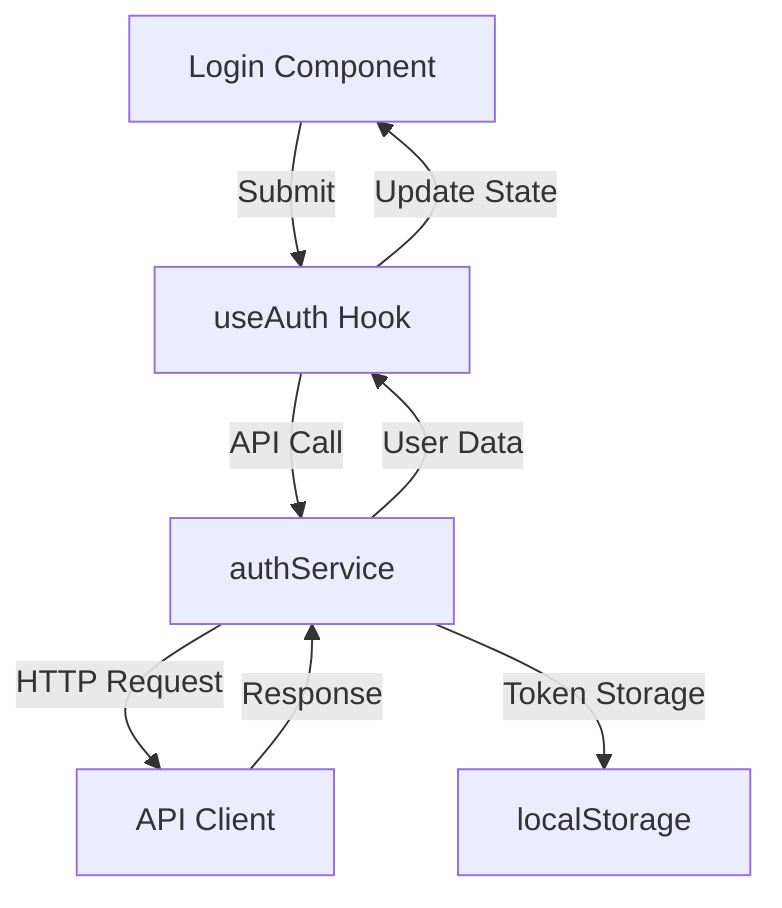

# Chat Application with React

A modern chat application built with React, featuring real-time messaging, user authentication, and a clean architecture.

## Table of Contents

- [Project Structure](#project-structure)
- [Getting Started](#getting-started)
- [Architecture](#architecture)
- [Naming Conventions](#naming-conventions)
- [Core Features](#core-features)
- [Authentication Flow](#authentication-flow)
- [Development Guidelines](#development-guidelines)

## Project Structure

```bash
src/
├── api/
│   ├── apiClient.js     # Centralized API client with request/response handling
│   └── endpoints.js     # API endpoint configurations
├── components/
│   ├── common/         # Reusable components
│   │   ├── Button.component.jsx
│   │   └── Input.component.jsx
│   ├── features/       # Feature-specific components
│   │   ├── Login.component.jsx
│   │   └── Chat.component.jsx
│   └── layout/        # Layout components
│       └── Header.component.jsx
├── hooks/
│   ├── api/           # API-related hooks
│   │   ├── useAuth.js
│   │   └── useChat.js
│   └── common/        # General purpose hooks
│       └── useLocalStorage.js
├── context/           # Context providers
│   └── ChatContext.jsx
├── services/          # Business logic and API service layer
│   ├── authService.js
│   └── chatService.js
├── constants/        # Constants and configurations
   └── endpoints.js
```

## Getting Started

### Prerequisites

- Node.js (v18 or higher)
- pnpm (preferred package manager)

### Installation

```bash
# Clone the repository
git clone [repository-url]

# Install dependencies
pnpm install

# Start development server
pnpm dev
```

## Architecture

### Layer-based Architecture

1. **UI Layer** (Components)

   - Handles user interactions
   - Manages component state
   - Renders UI elements

2. **Hook Layer** (Custom Hooks)

   - Manages complex state logic
   - Handles API interactions
   - Provides reusable functionality

3. **Service Layer**

   - Implements business logic
   - Handles API communication
   - Manages data transformation

4. **API Layer**
   - Centralizes API requests
   - Handles authentication
   - Manages response parsing

## Naming Conventions

### Files and Directories

- **Components**: PascalCase with .component.jsx suffix
  ```
  Button.component.jsx
  Login.component.jsx
  ```
- **Hooks**: camelCase with .hook.js suffix
  ```
  useAuth.hook.js
  useChat.hook.js
  ```
- **Services**: camelCase with Service suffix
  ```
  authService.js
  chatService.js
  ```
- **Utils**: kebab-case
  ```
  api-client.js
  date-formatter.js
  ```

### Component Conventions

- Use functional components with hooks
- Props should be typed with TypeScript
- Keep components focused and single-responsibility

## Core Features

### Authentication

- User registration
- Login/Logout
- Token-based authentication
- Persistent sessions

### Chat Functionality

- Real-time messaging
- Online user status
- Message history
- Chat room management

## Authentication Flow



## Development Guidelines

### State Management

- Use React Context for global state
- Prefer hooks for component state
- Implement proper error boundaries

### API Integration

- Use centralized apiClient
- Handle errors consistently
- Implement proper loading states

### Code Style

- Use ESLint and Prettier
- Follow component composition patterns
- Implement proper TypeScript types

### Testing

- Write unit tests for utilities
- Test hooks with @testing-library/react-hooks
- Implement integration tests for critical flows

## Error Handling

### API Errors

```javascript
try {
  await apiClient.request(endpoint, options);
} catch (error) {
  // Transform error to user-friendly format
  throw new Error(error.message || "An unexpected error occurred");
}
```

### Component Error Boundaries

```jsx
<ErrorBoundary fallback={<ErrorMessage />}>
  <Component />
</ErrorBoundary>
```

## Contributing

1. Fork the repository
2. Create your feature branch
3. Commit changes following conventional commits
4. Push to the branch
5. Create a Pull Request

## License

This project is licensed under the MIT License - see the LICENSE file for details
